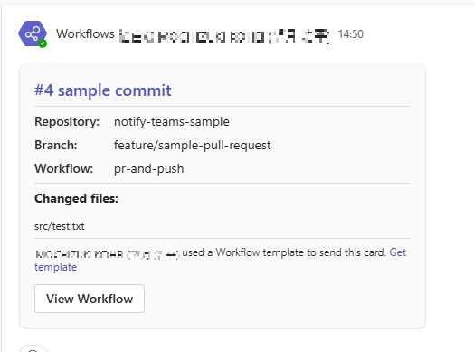
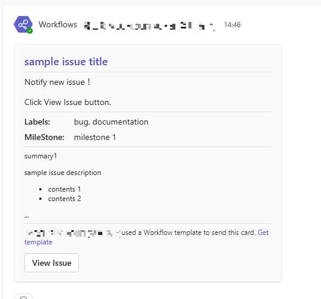
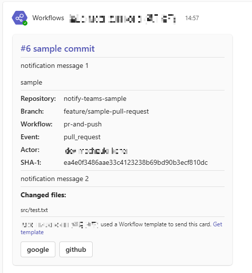

# Notify Teams Workflows Webhook

[](https://github.com/super-linter/super-linter)
 

[日本語](./README.md)

---

- [Notify Teams Workflows Webhook](#notify-teams-workflows-webhook)
  - [Summary](#summary)
    - [When creating a pull request or executing a push](#when-creating-a-pull-request-or-executing-a-push)
    - [When creating an issue](#when-creating-an-issue)
    - [Other](#other)
  - [Usage](#usage)
    - [Workflows](#workflows)
    - [Permission](#permission)
    - [Template](#template)
      - [Default template](#default-template)
      - [Custom template](#custom-template)
      - [Variables](#variables)
    - [Configuration](#configuration)
    - [Users](#users)
  - [Versioning](#versioning)
  - [Contributing](#contributing)
  - [License](#license)

---

## Summary

This action sends a POST request to the Webhook URL created in the workflows of the specified Teams. The main functions provided are as follows.

- Template file specification of notification content (adaptive card format body can be customized)
- Provide pull requests, issues, and other display information as variables
- Designation of button to go to an arbitrary URL
- Specify Mention for Teams users in the notification message.
- Ignore notifications for commit messages containing specific keywords.

By default, it sends JSON data containing the following elements:

### When creating a pull request or executing a push

- body
  - Workflow number
  - Last commit message
  - Last commit change file
  - Repository name
  - branch name
  - Workflow name
- actions
  - Button to navigate to the GitHub workflow screen



<details>
<summary>Example of call</summary>

```yaml
name: pr-and-push
on:
  pull_request:
    types: [opened]
jobs:
  build:
    runs-on: ubuntu-latest
    steps:
      - uses: actions/checkout@v4
        with:
          fetch-depth: 2
      - name: notify
        uses: PanasonicConnect/notify-teams-workflows-webhook@v1
        with:
          webhook-url: ${{ secrets.TEAMS_WEBHOOK_URL }}
```

</details>

### When creating an issue

- body
  - Issue title
  - Labels set in Issue
  - Milestones set for the Issue
  - Issue text
- actions
  - Button to navigate to the Issue details page



<details>
<summary>Example of call</summary>

```yaml
name: issue sample
on:
  issues:
    types: [opened]
jobs:
  add-issue:
    name: Add issue
    runs-on: ubuntu-latest
    steps:
      - name: notify test
        uses: PanasonicConnect/notify-teams-workflows-webhook@v1
        with:
          webhook-url: ${{ secrets.TEAMS_WEBHOOK_URL }}
          message1: Notify new issue！\n\nClick View Issue button.
```

</details>

### Other

You can also change the default display content or customize the submission content based on a user-created template file.



<details>
<summary>Example of call</summary>

```yaml
name: pr-and-push
on:
  pull_request:
    types: [opened]
jobs:
  build:
    runs-on: ubuntu-latest
    steps:
      - uses: actions/checkout@v4
        with:
          fetch-depth: 2
      - name: notify
        uses: PanasonicConnect/notify-teams-workflows-webhook@v1
        with:
          webhook-url: ${{ secrets.TEAMS_WEBHOOK_URL }}
          message1: notification message 1\n\nsample
          message2: notification message 2
          config: './.github/notify-config.json'
          action-titles: |
            google
            github
          action-urls: |
            https://www.google.co.jp/
            https://github.com/
```

</details>

## Usage

Please obtain the Teams Workflows Webhook URL in advance and set it in the repository.

### Workflows

```yaml
- uses: actions/checkout@v4
  with:
    # Ensure fetch-depth is set to 0 or greater than 1 to display changed files
    fetch-depth: 2
- uses: PanasonicConnect/notify-teams-workflows-webhook
  with:
    # Specify the Workflows Webhook URL for the Teams notification channel
    webhook-url: ${{ secrets.TEAMS_WEBHOOK_URL }}
    # Specify the path to the template file (.json) if using a custom template
    # default: none
    # example: .github/config/notify-template.json
    template: ''
    # Specify the path to the configuration file (.json) if using custom settings
    # default: none
    # example: .github/config/notify-config.json
    config: ''
    # Specify the path to the user definition file (.json), if using mention
    # default: none
    # example: .github/config/notify-users.json
    users: ''
    # Specify the parameter for sending custom message 1
    # default: none
    message1: ''
    # Specify the parameter for sending custom message 2
    # default: none
    message2: ''
    # Specify the title of the action button to be added to the notification message
    # default: View Workflow
    # example: ['View Workflow', 'View Pages']
    action-titles: []
    # Specify the URL to navigate to when the action button is pressed
    # default: URL of the workflow execution history screen that executed this action
    # example: ['https://github-workflow-url', 'https://github-pages-url']
    action-urls: []
```

Minimum Settings

```yaml
- uses: PanasonicConnect/notify-teams-workflows-webhook@v1
  with:
    webhook-url: ${{ secrets.TEAMS_WEBHOOK_URL }}
```

### Permission

```yaml
permissions:
  contents: read
```

### Template

You can define the data sent as the body in the adaptive card format sent to the Teams workflows webhook URL as a template.

```json
{
  "attachments": [
    {
      "contentType": "application/vnd.microsoft.card.adaptive",
      "content": {
        "$schema": "http://adaptivecards.io/schemas/adaptive-card.json",
        "type": "AdaptiveCard",
        "version": "1.2",
        "body": [], // Automatically generated based on the template parameter or default template content
        "actions": [] // Automatically generated based on the action-titles and action-urls parameters
      }
    }
  ]
}
```

#### Default template

If the template parameter is not specified, the following template will be used. The parts enclosed in `{` and `}` in the template are treated as variables and
will be replaced with the values at the time of workflow execution.

```json
[
  {
    "type": "TextBlock",
    "text": "{GITHUB_RUN_NUMBER} {COMMIT_MESSAGE}",
    "id": "Title",
    "spacing": "Medium",
    "size": "large",
    "weight": "Bolder",
    "color": "Accent"
  },
  {
    "type": "TextBlock",
    "text": "{CUSTOM_MESSAGE_1}",
    "separator": true,
    "wrap": true
  },
  {
    "type": "FactSet",
    "facts": [
      {
        "title": "Repository:",
        "value": "{GITHUB_REPOSITORY}"
      },
      {
        "title": "Branch:",
        "value": "{BRANCH}"
      },
      {
        "title": "Workflow:",
        "value": "{GITHUB_WORKFLOW}"
      },
      {
        "title": "Event:",
        "value": "{GITHUB_EVENT_NAME}"
      },
      {
        "title": "Actor:",
        "value": "{GITHUB_ACTOR}"
      },
      {
        "title": "SHA-1:",
        "value": "{GITHUB_SHA}"
      }
    ],
    "separator": true,
    "id": "acFactSet"
  },
  {
    "type": "TextBlock",
    "text": "{CUSTOM_MESSAGE_2}",
    "separator": true,
    "wrap": true
  },
  {
    "type": "TextBlock",
    "text": "**Changed files:**",
    "separator": true,
    "wrap": true
  },
  {
    "type": "TextBlock",
    "text": "{CHANGED_FILES}",
    "size": "small",
    "wrap": false
  }
]
```

#### Custom template

The template parameter allows the specification of a user-created template file. Please refer to
[Overview of adaptive cards for Microsoft Teams](https://learn.microsoft.com/en-us/power-automate/overview-adaptive-cards) for more information on template
creation.

```json
[
  {
    "type": "TextBlock",
    "text": "{COMMIT_MESSAGE}",
    "separator": true,
    "wrap": true
  },
  {
    "type": "TextBlock",
    "text": "{CHANGED_FILES}",
    "size": "small",
    "wrap": false
  }
]
```

#### Variables

The following variables can be used in the template file.

| Variable Name       | Description                                     |
| ------------------- | ----------------------------------------------- |
| {CUSTOM_MESSAGE_1}  | Custom message 1                                |
| {CUSTOM_MESSAGE_2}  | Custom message 2                                |
| {GITHUB_RUN_NUMBER} | Workflow run number                             |
| {COMMIT_MESSAGE}    | First line of the last commit message           |
| {GITHUB_SHA}        | SHA-1 value of the last commit                  |
| {CHANGED_FILES}     | Changed files in the last commit                |
| {AUTHOR}            | Author in the last commit                       |
| {GITHUB_REPOSITORY} | Repository name                                 |
| {BRANCH}            | Branch name                                     |
| {GITHUB_WORKFLOW}   | Workflow name                                   |
| {GITHUB_EVENT_NAME} | Event name that triggered the workflow          |
| {GITHUB_ACTOR}      | Username of the user who triggered the workflow |
| {ISSUE_TITLE}       | Issue title.                                    |
| {ISSUE_LABELS}      | Labels set in Issue.                            |
| {ISSUE_MILESTONE}   | Milestones set for the Issue.                   |
| {ISSUE_BODY}        | Issue text.                                     |

### Configuration

By specifying the config parameter, you can customize the content and conditions of the notification. Comments in the following json are included for
illustrative purposes, but comments cannot be included in the actual json.

```json
{
  // Specify whether to display each item of the Default Template
  "visible": {
    // Specify whether to display the block containing {GITHUB_REPOSITORY}
    // default: true
    "repository_name": true,
    // Specify whether to display the block containing {BRANCH}
    // default: true
    "branch_name": true,
    // Specify whether to display the block containing {GITHUB_WORKFLOW}
    // default: true
    "workflow_name": true,
    // Specify whether to display the block containing {GITHUB_EVENT_NAME}
    // default: false
    "event": false,
    // Specify whether to display the block containing {GITHUB_ACTOR}
    // default: false
    "actor": false,
    // Specify whether to display the block containing {GITHUB_SHA}
    // default: false
    "sha1": false,
    // Specify whether to display the block containing {CHANGED_FILES}
    // default: true
    "changed_files": true
  },
  "notification": {
    // Specify whether to ignore notifications if certain keywords are included in the commit message
    // default: false
    // example: ["ignore:", "typo:"]
    "ignoreKeywords": []
  },
  "changedFile": {
    // Specify the maximum number of changed files to display
    // default: 10
    "max": 10
  },
  "filter": {
    // Filter changed files to notify by specific file extensions
    // Only files with the specified extensions will be included in notifications
    // No filtering is applied if empty array or not specified
    // default: not specified
    // example: [".js", ".ts", ".json"]
    "extension": []
  },
  "issue": {
    // Specifies the maximum number of lines to display in the Issue body
    // default: 5
    "maxLines": 5
  }
}
```

### Users

Mention can be made by specifying the users parameter. Comments in the following json are included for illustrative purposes, but comments cannot be included in
the actual json.

```json
[
  {
    "alias": "Admin", // Specify the alias name to be used in the message
    "displayName": "Tech Lead", // Specify the name as it appears on Teams
    "id": "userName1@domain" // Specify your user ID on Teams
  },
  {
    "alias": "Admin2",
    "displayName": "DevOps Engineer",
    "id": "userName2@domain"
  }
]
```

When notifying with a mentions, please enclose the alias name in the message with `<at></at>`.

```yaml
- uses: PanasonicConnect/notify-teams-workflows-webhook@v1
  with:
    webhook-url: ${{ secrets.TEAMS_WEBHOOK_URL }}
    message1: notification for <at>Admin</at> <at>Admin2</at>
```

## Versioning

Semantic versioning is used for version control. See the tags in this repository for available versions.

## [Contributing](./CONTRIBUTING.md)

## License

The scripts and documentation in this project are released under the [MIT License](./LICENSE).
