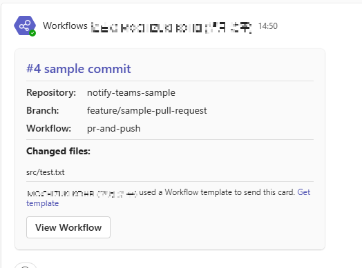
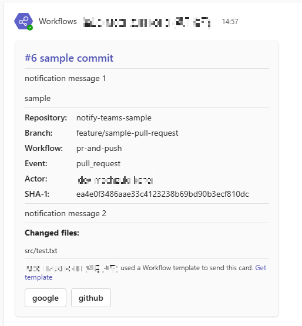

# Notify teams workflows webhook

[](https://github.com/super-linter/super-linter)
 

[English](./README-en.md)

---

- [Notify teams workflows webhook](#notify-teams-workflows-webhook)
  - [Summary](#summary)
    - [Pull Request作成やpush実行時](#pull-request作成やpush実行時)
    - [Issue作成時](#issue作成時)
    - [その他](#その他)
  - [Usage](#usage)
    - [Workflows](#workflows)
    - [Permission](#permission)
    - [Template](#template)
      - [Default template](#default-template)
      - [Custom template](#custom-template)
      - [Variables](#variables)
    - [Configuration](#configuration)
    - [Users](#users)
  - [Versioning](#versioning)
  - [Contributing](#contributing)
  - [License](#license)

---

## Summary

このアクションは、指定されたTeamsのworkflowsで作成したWebhook URLにPOSTリクエストを送信します主な提供機能は下記の通りです。

- 通知内容のテンプレートファイル指定 (アダプティブカード形式のbodyをカスタマイズ可能です)
- Pull RequestやIssue等の表示情報を変数で提供
- 任意のURLに遷移するボタンの指定
- 通知メッセージ内にTeamsユーザーに対するメンションの指定
- 特定のキーワードを含むコミットメッセージについて通知を無視する設定

デフォルトでは以下の要素を含むJSONデータを送信します。

### Pull Request作成やpush実行時

- body
  - ワークフロー番号
  - 最終コミットのメッセージ
  - 最終コミットの変更ファイル
  - リポジトリ名
  - ブランチ名
  - ワークフロー名
- actions
  - GitHubのワークフロー画面に遷移するボタン



<details>
<summary>呼び出し例</summary>

```yaml
name: pr-and-push
on:
  pull_request:
    types: [opened]
jobs:
  build:
    runs-on: ubuntu-latest
    steps:
      - uses: actions/checkout@v4
        with:
          fetch-depth: 2
      - name: notify
        uses: PanasonicConnect/notify-teams-workflows-webhook@v1
        with:
          webhook-url: ${{ secrets.TEAMS_WEBHOOK_URL }}
```

</details>

### Issue作成時

- body
  - Issueタイトル
  - Issueに設定されたラベル
  - Issueに設定されたマイルストーン
  - Issue本文
- actions
  - Issueの詳細画面に遷移するボタン


<details>
<summary>呼び出し例</summary>

```yaml
name: issue sample
on:
  issues:
    types: [opened]
jobs:
  add-issue:
    name: Add issue
    runs-on: ubuntu-latest
    steps:
      - name: notify test
        uses: PanasonicConnect/notify-teams-workflows-webhook@v1
        with:
          webhook-url: ${{ secrets.TEAMS_WEBHOOK_URL }}
          message1: Notify new issue！\n\nClick View Issue button.
```

</details>

### その他

デフォルトの表示内容を変更したり、ユーザーが作成したテンプレートファイルを元に送信内容をカスタマイズすることもできます。



<details>
<summary>呼び出し例</summary>

```yaml
name: pr-and-push
on:
  pull_request:
    types: [opened]
jobs:
  build:
    runs-on: ubuntu-latest
    steps:
      - uses: actions/checkout@v4
        with:
          fetch-depth: 2
      - name: notify
        uses: PanasonicConnect/notify-teams-workflows-webhook@v1
        with:
          webhook-url: ${{ secrets.TEAMS_WEBHOOK_URL }}
          message1: notification message 1\n\nsample
          message2: notification message 2
          config: './.github/notify-config.json'
          action-titles: |
            google
            github
          action-urls: |
            https://www.google.co.jp/
            https://github.com/
```

</details>

## Usage

予めTeamsのWorkflows Webhook URLを取得して、リポジトリに設定しておいてください。

### Workflows

```yaml
- uses: actions/checkout@v4
  with:
    # 変更ファイルを表示する際は必ずfetch-depthを0または1より大きい値にしてください
    fetch-depth: 2
- uses: PanasonicConnect/notify-teams-workflows-webhook
  with:
    # Teamsの通知先チャネルのWorkflows Webhook URLを指定してください
    webhook-url: ${{ secrets.TEAMS_WEBHOOK_URL }}
    # 送信内容のテンプレートファイル(.json)を使用する場合はパスを指定してください
    # default: 指定なし
    # example: .github/config/notify-template.json
    template: ''
    # 送信設定ファイル(.json)を使用する場合はパスを指定してください
    # default: 指定なし
    # example: .github/config/notify-config.json
    config: ''
    # ユーザー定義ファイル(.json)を使用する場合はパスを指定してください
    # default: 指定なし
    # example: .github/config/notify-users.json
    users: ''
    # カスタムメッセージ1を送信する場合は以下のパラメータを指定してください
    # default: 指定なし
    message1: ''
    # カスタムメッセージ2を送信する場合は以下のパラメータを指定してください
    # default: 指定なし
    message2: ''
    # 通知メッセージに付与するアクションボタンのタイトルを指定してください
    # default: View Workflow
    # example: ['View Workflow', 'View Pages']
    action-titles: []
    # 通知メッセージに付与するアクションボタン押下時に遷移するURLを指定してください
    # default: 本アクションを実行したワークフロー実行履歴画面のURL
    # example: ['https://github-workflow-url', 'https://github-pages-url']
    action-urls: []
```

最小の設定

```yaml
- uses: PanasonicConnect/notify-teams-workflows-webhook@v1
  with:
    webhook-url: ${{ secrets.TEAMS_WEBHOOK_URL }}
```

### Permission

```yaml
permissions:
  contents: read
```

### Template

Teams workflows webhook URLに送信するアダプティブカード形式のデータのうち、bodyとして送信するデータをテンプレートして定義することができます。

```json
{
  "attachments": [
    {
      "contentType": "application/vnd.microsoft.card.adaptive",
      "content": {
        "$schema": "http://adaptivecards.io/schemas/adaptive-card.json",
        "type": "AdaptiveCard",
        "version": "1.2",
        "body": [], // templateパラメータで指定したファイルの内容、またはDefault template内容により自動生成されます
        "actions": [] // action-titles, action-urlsパラメータ指定内容により自動生成されます
      }
    }
  ]
}
```

#### Default template

templateパラメータを指定しない場合は下記テンプレートが使用されます。テンプレート内の`{`と`}`で囲まれた箇所が変数として扱われ、ワークフロー実行時の値に置換されて送信されます。

```json
[
  {
    "type": "TextBlock",
    "text": "{GITHUB_RUN_NUMBER} {COMMIT_MESSAGE}",
    "id": "Title",
    "spacing": "Medium",
    "size": "large",
    "weight": "Bolder",
    "color": "Accent"
  },
  {
    "type": "TextBlock",
    "text": "{CUSTOM_MESSAGE_1}",
    "separator": true,
    "wrap": true
  },
  {
    "type": "FactSet",
    "facts": [
      {
        "title": "Repository:",
        "value": "{GITHUB_REPOSITORY}"
      },
      {
        "title": "Branch:",
        "value": "{BRANCH}"
      },
      {
        "title": "Workflow:",
        "value": "{GITHUB_WORKFLOW}"
      },
      {
        "title": "Event:",
        "value": "{GITHUB_EVENT_NAME}"
      }
      {
        "title": "Actor:",
        "value": "{GITHUB_ACTOR}"
      }
      {
        "title": "SHA-1:",
        "value": "{GITHUB_SHA}"
      }
    ],
    "separator": true,
    "id": "acFactSet"
  },
  {
    "type": "TextBlock",
    "text": "{CUSTOM_MESSAGE_2}",
    "separator": true,
    "wrap": true
  },
  {
    "type": "TextBlock",
    "text": "**Changed files:**",
    "separator": true,
    "wrap": true
  },
  {
    "type": "TextBlock",
    "text": "{CHANGED_FILES}",
    "size": "small",
    "wrap": false
  }
]
```

#### Custom template

templateパラメータでは、ユーザーが作成したテンプレートファイルを指定することができます。テンプレート作成については[Microsoft Teams 向けアダプティブ カードの概要](https://learn.microsoft.com/ja-jp/power-automate/overview-adaptive-cards)
を参考にしてください。

```json
[
  {
    "type": "TextBlock",
    "text": "{COMMIT_MESSAGE}",
    "separator": true,
    "wrap": true
  },
  {
    "type": "TextBlock",
    "text": "{CHANGED_FILES}",
    "size": "small",
    "wrap": false
  }
]
```

#### Variables

テンプレートファイル内で使用可能な変数は以下の通りです。

| 変数名              | 説明                                       |
| ------------------- | ------------------------------------------ |
| {CUSTOM_MESSAGE_1}  | カスタムメッセージ1                        |
| {CUSTOM_MESSAGE_2}  | カスタムメッセージ2                        |
| {GITHUB_RUN_NUMBER} | ワークフロー実行番号                       |
| {COMMIT_MESSAGE}    | 最終コミットのメッセージの最初の行         |
| {GITHUB_SHA}        | 最終コミットのSHA-1値                      |
| {CHANGED_FILES}     | 最終コミットの変更ファイル                 |
| {AUTHOR}            | 最終コミットの著者                         |
| {GITHUB_REPOSITORY} | リポジトリ名                               |
| {BRANCH}            | ブランチ名                                 |
| {GITHUB_WORKFLOW}   | ワークフロー名                             |
| {GITHUB_EVENT_NAME} | ワークフローのトリガーとなったイベント名   |
| {GITHUB_ACTOR}      | ワークフローのトリガーを実行したユーザー名 |
| {ISSUE_TITLE}       | Issueのタイトル                            |
| {ISSUE_LABELS}      | Issueに設定されたラべル                    |
| {ISSUE_MILESTONE}   | Issueに設定されたマイルストーン            |
| {ISSUE_BODY}        | Issueの本文                                |

### Configuration

configパラメータを指定することで、送信内容、条件のカスタマイズを行うことができます。以下json内のコメントは説明のために記載していますが、実際のjson内にコメントを記載することはできません。

```json
{
  // Default Templateの各項目を表示するかどうかを指定します
  "visible": {
    // {GITHUB_REPOSITORY}を含むBlockを表示するかどうかを指定します
    // default: true
    "repository_name": true,
    // {BRANCH}を含むBlockを表示するかどうかを指定します
    // default: true
    "branch_name": true,
    // {GITHUB_WORKFLOW}を含むBlockを表示するかどうかを指定します
    // default: true
    "workflow_name": true,
    // {GITHUB_EVENT_NAME}を含むBlockを表示するかどうかを指定します
    // default: false
    "event": false,
    // {GITHUB_ACTOR}を含むBlockを表示するかどうかを指定します
    // default: false
    "actor": false,
    // {GITHUB_SHA}を含むBlockを表示するかどうかを指定します
    // default: false
    "sha1": false,
    // {CHANGED_FILES}を含むBlockを表示するかどうかを指定します
    // default: true
    "changed_files": true
  },
  "notification": {
    // 特定のキーワードがコミットメッセージに含まれる場合に通知を無視するかどうかを指定します
    // default: false
    // example: ["ignore:", "typo:"]
    "ignoreKeywords": []
  },
  "changedFile": {
    // 表示する変更ファイルの最大数を指定します
    // default: 10
    "max": 10
  },
  "filter": {
    // 通知する変更ファイルを特定の拡張子でフィルタリングします
    // 指定された拡張子のファイルのみが通知対象となります
    // 空の配列または未指定の場合はフィルタリングしません
    // default: 指定なし
    // example: [".js", ".ts", ".json"]
    "extension": []
  },
  "issue": {
    // Issue本文の表示する最大行数を指定します
    // default: 5
    "maxLines": 5
  }
}
```

### Users

usersパラメータを指定することで、メンションを行うことができます。以下json内のコメントは説明のために記載していますが、実際のjson内にコメントを記載することはできません。

```json
[
  {
    "alias": "Admin", // メッセージ内で利用するエイリアス名を指定してください
    "displayName": "Tech Lead", // Teams上で表示される名前を指定してください
    "id": "userName1@domain" // Teams上でのユーザーIDを指定してください
  },
  {
    "alias": "Admin2",
    "displayName": "DevOps Engineer",
    "id": "userName2@domain"
  }
]
```

メンション付きの通知を行う際は、メッセージ内にエイリアス名を`<at></at>`で囲んで記述してください。

```yaml
- uses: PanasonicConnect/notify-teams-workflows-webhook@v1
  with:
    webhook-url: ${{ secrets.TEAMS_WEBHOOK_URL }}
    message1: notification for <at>Admin</at> <at>Admin2</at>
```

## Versioning

バージョン管理にはセマンティック・バージョニングを使用しています。 利用可能なバージョンについては、このリポジトリのタグを参照してください。

## [Contributing](./CONTRIBUTING.md)

## License

このプロジェクトのスクリプトとドキュメントは[MITライセンス](./LICENSE)でリリースされています。
